# Linton's Lights: Memory Game

#### Code Institute Full Stack Development Dipoloma: Milestone Project 2 - Interactive Frontend Development 
##### Created by William Donovan

# Table of Contents 

1. [UX Development](#uxdev)
   - Project Manifesto and Aim
   - Player Goals
   - Educational Goals
   - Parental Goals
   - Developer and Business goals
   - User Stories 
   - Design Principles 
     * Fonts
     * Icons
     * Colours
   - Sitemap and Wireframes
   - Features and Future Implementations 
2. [Testing](#testing)
   - Jasmine Testing 
   - Game Testing / Life Cycle
   - HTML and CSS checks using WC3 
   - User Testing
   - Peer Code Review
3. [Bugs and De-bugging](#bugs)
   - Known bugs
   - Solutions 
4. [Technologies Used](#languages)
   - Languages Utilised
   - Online Material
   - Tools and Databases Used
5. [Project Deployment](#deployment)
   - Process of Deployment
   - How to create local version
6. [References](#references)
7. [Acknowledgements](#acknowledge)

# UX Development 

### Project Manifesto and Aim

During the COVID-19 pandemic nearly every aspect of life has been affected. One sector in particular that has caused controversy and unrest is education. 
The decision over schooling has once again turned domestic as children of all ages are made to work at home. 

My aim for the web application is to create a fun, interactive game that encourages cognitive development. Hopefully the contextual story of the game will make it 
more enaging as my goal is to target children between the ages of 9-13. Giving them something still educational but more aligned with how this generation process information.

This game is aimed to help parents too. Keeping the children engaged outside of school work will help eleveate their need to waste valuable work time.

### Player Goals

   - Fun story game to Play
   - Child Friendly characters (Linton)
   - Simple design and big buttons for easy Play
   - Diffiuclty tiers for engaging challenges
   - Visual and Audio rewards during the game
   - Completion banner as reward

### Educational Goals

   - Brain Training using memory receptors 
   - Help with non-verbal reasoning 
   - Linton's rules will be readable for this age group, aid with language learning
   - User name input, help with spelling

### Parental Goals 

   - Easy to use system
   - Child friendly Material
   - Wholesome intrinsic message to help save the world
   - Simple rules 

### Developer and Business Goals

   - Create sprite character for use in follow up games
   - Intuitive and easy design 

# User Stories

1. As a user between the ages 9-15, I want a game that:
   - Has an underlying fun story masked in as the game
   - Something to do in between school work
   - Characters to attach to
   - Bright but engaging colour scheme 
   - Easy to read but dramatiuc language 
   - Different difficulties and levels for competition

2. As a parent, I would like a game for my child that:
   - Keeps their brains stimulated but helps learning development
   - Appropriate context and Language
   - Easy to teach design and layout 
   - Something engaging incase I need to work late or I'm busy working from homne

# Design Principles

## Fonts

1. Title 

   For this I chose the google font **Hachi Maru Pop**. It has a Pixar-esque feel with the 'i' symbolising a light. Below is an example of the title font:

   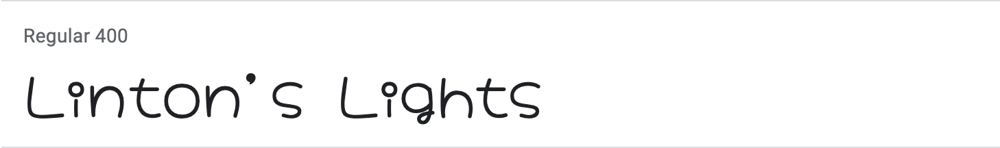

2. Linton's rules

   For the pop up rules message, I wanted a more retro and original game style, similar to the read messages from Pokemon.
   The font I decided on was **Source Code Pro** due to computer/lost in space feel. Below is an example of the message font:

   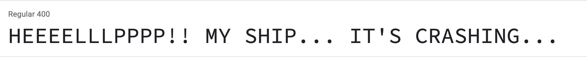

    The **Source Code Pro** will also be used on the homepage for user input, start button and any other needed text.

## Icons

1. Linton

    I wanted to create a character that could live through multiple game settings and that character is called Linton.
    In this scenario, Linton is an Astronaut because I felt it would appeal to the target age group/audience. 
    
    Astronauts have an intrinsically positive message when it comes to the Earth. 
    They are either known for saving it, exploring it and never wanting to hurt it. With the COVID-19 and environmental issues we face in the 21st Century, I thought this choice would naturally help spread positivity about the Earth.

    

2. Spaceship

    For context, I chose this spaceship for the user to save. As a feature, when you complete the game, after
    Linton says congratulations, the rocket will fly across the screen:

    

## Colours

The colour scheme for this web application is comprised of two palettes: Space | Buttons.
I used [Coloors](https://coolors.co/), an online colour palette generator for cohesive, thoughtful and bold colours to match the game.

### Space
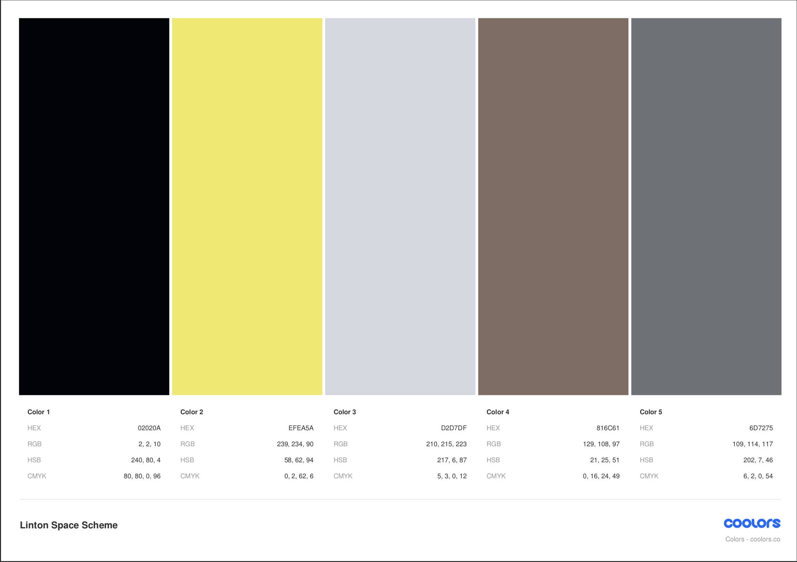

### Buttons
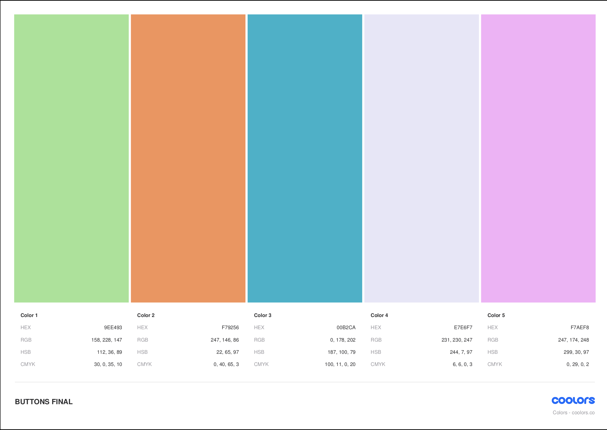

# Sitemap / Wireframes

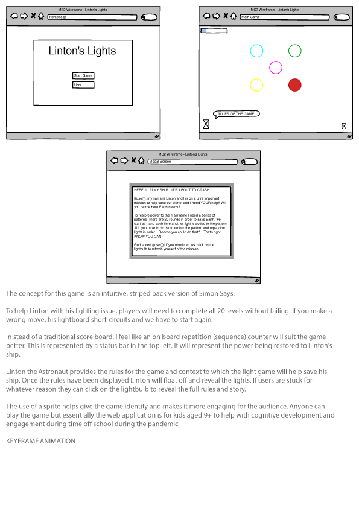

# Features / Future Implementations

-  I hope in the future I can progress the animation and some different level tiers. 
-  Improve Linton's animation and messages.
--------------------

# Testing 

## Jasmine Testing 

- I attempted Jasmine testing but really couldn't get the automatic tests to work with this project. All my code and bugs were fixed 
through manual testing. Know this might affect the project but it was just something I couldn't seem to get working.

## Game Testing / Life Cycle

- My first piece of gaming code was to add fucntionality to the 'Start' button and create 
a blank 'game' function template, outlining the necessary variables. I decided to use the 'event' click
function to initialise and trigger the game: 

  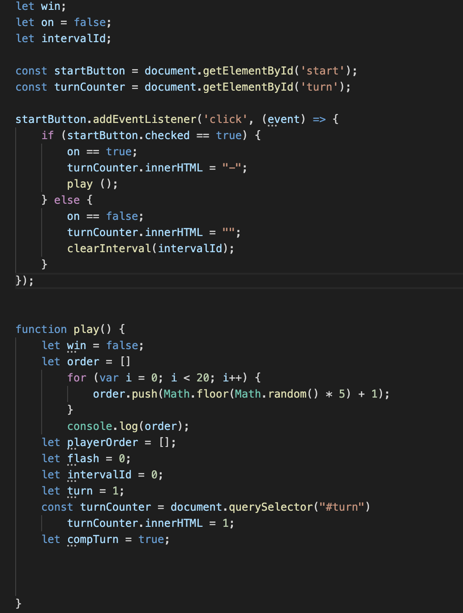

- TEST: When my start button is "checked" returing **true**, the "on" variable becomes **true** and the **play** function
is passsed. From here my "for" loop fills the **order** array with 20 random numbers from 1-5, these random numbers
will be used to determine which light is flashed for each round. Below is an example, I checked the start button 3 times, 
each array returned a random and different set of values each time, which I printed onto the console.log:

   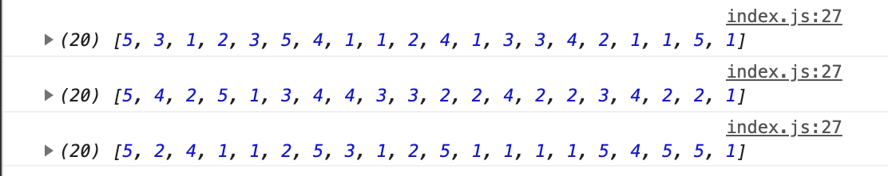

- After doing some reading and looking over notes, I forgot one could assign button values. My overall design only needs a "Start Button"
to return a **true** value for the game to **initialise** and start. This is my start button function now:

   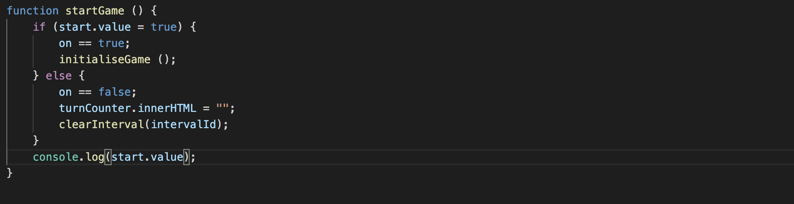

- Hit a slight wall with the color iteration so moved on to the homepage for styling. The image is still but i've used some simple
keyframe animation to make Linton float and have a slight moving star background:

   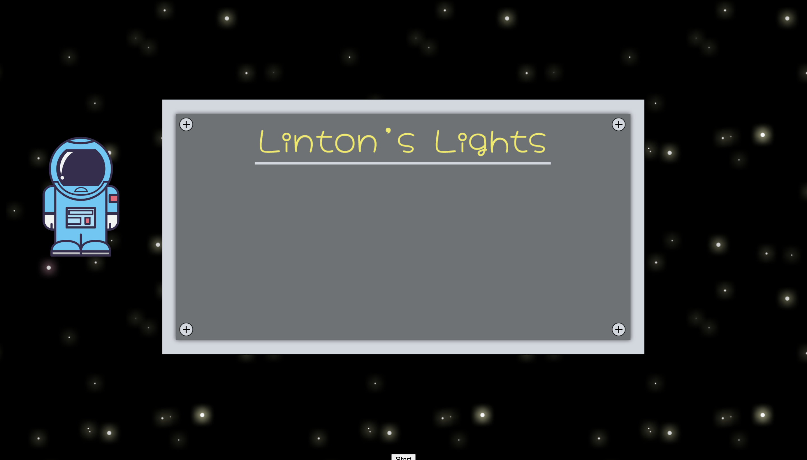

- TEST: Fixed and tested the basic game function. Clicked start and end 20 times to test all the lights work according to their turn
in the array. Moving on next to adding user interaction:

   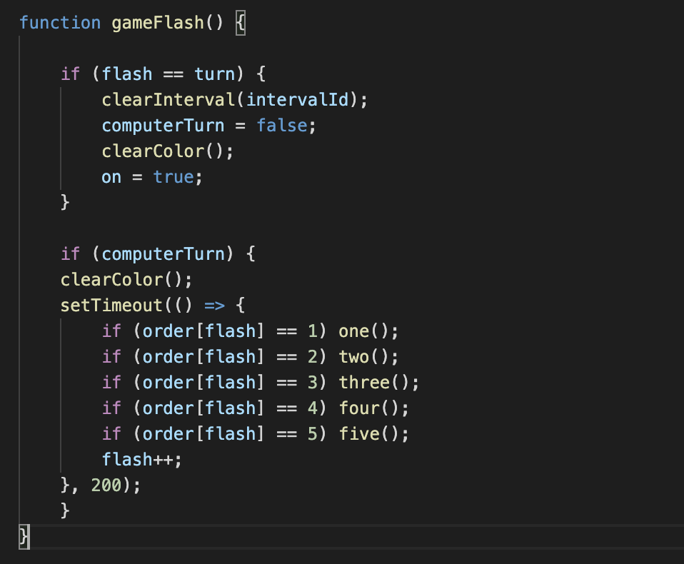

- Had issues whilst testing my playerClick function. My **if** statement to remove the fill color is completed if the **win** variable is not true.
Initially the function had interactivity and the user could click the color but the fill wouldn't timeout. I removed the (!win) method 
and attached the setTimeout function to the clickEventListener and the fill was removed after 400ms. From this test I realised the **win** variable 
wasn't returning flase, even though I declared the value inside the initialiseGame function. To rectify the issue, I just declared the **win** value
as false in the global scope. Now the basic playerClick function works:

   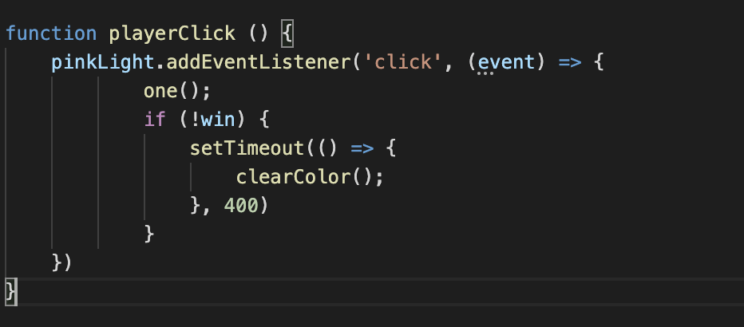
   
- TEST: I just tested the finished game functionality and nearly everything is working. The only issue I ran into when testing the game was clicking the wrong
light. This probably has something to do with the if else condition if good == true... I need the an error to show and the round to repeat.

- TEST: Tried testing the game through to level 20. Once I hit level 5, the game stops progressing and seems the on variable stays on true. Going back through the 
code to see why it only goes to level 5.
   - SOlUTION: Managed to solve both the issues that arose from these tests. I placed all the variables inside the wrong choise if condition which seemed to 
   galvinise all the code I had seperated previously
   
   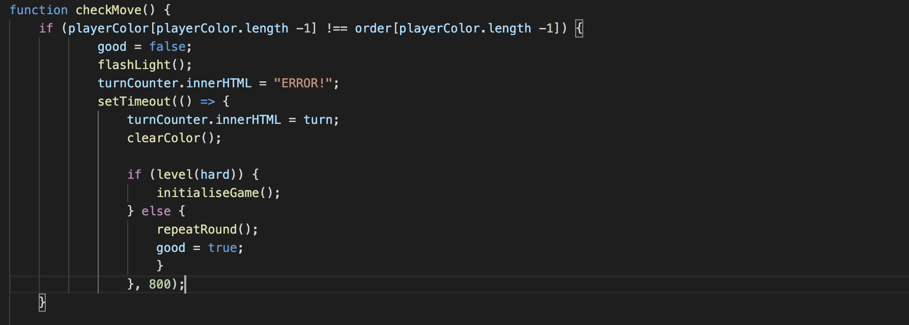

- Moving back onto styling my homepage and creating the landing tile. I've created a button that links to the game page with basic styling but I can't seem to 
center the button ontop of my score board image. 

   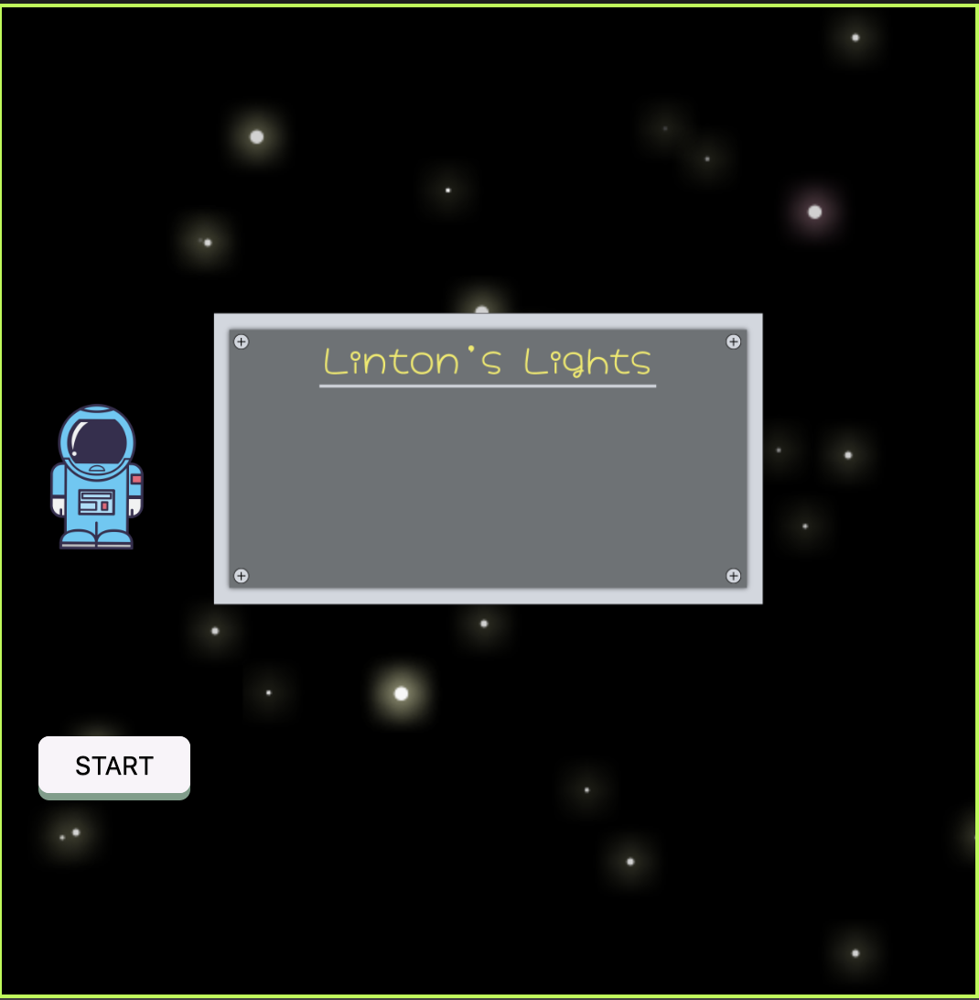

   - SOLUTION: To arrange and size the scoreboard, I need to place the image inside another div and position it absolute in relation
    to it's parent div.

- Nearly coming to a close with the homepage, everything has full interactivity and works. Now when the username submit button is clicked it produces a personalised 
message telling the user how to start.

   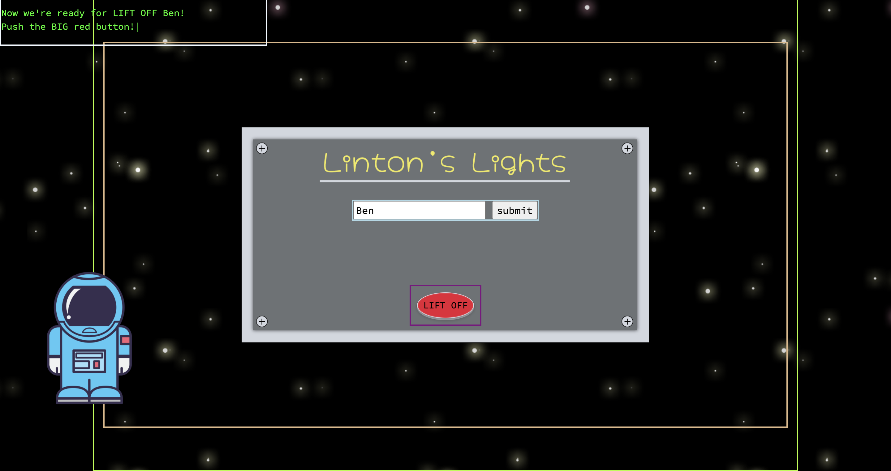

- TEST: The text typing animation and the time needed to increase for it to appear relistic but with each time increase, it slows down the 
typing. Need to find a way of implementing animation delay and keeping the text hidden.

   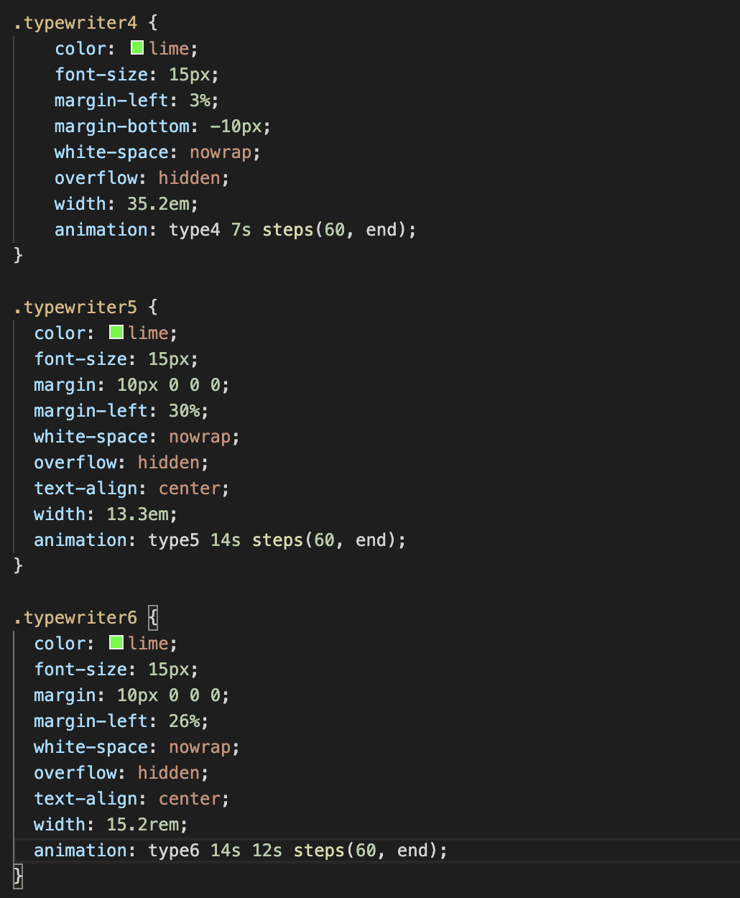

   - SOLUTION: I tried multiple ways of achieving this effect for the long segment of text but became too difficult and time consuming,
    could possibly introduce this animation properly in the future.

- TEST: Pushing the start button at the bottom of instructions and realised the turn counter pushes the game down when it's DIV appears. Placing the turn
function inside the container to keep everything harmonious and clean.

- One of my final hurdles before applying finishing touches was transitioning from having the instructions on screen to having showing the game 
mainframe. By applying some simple jQuery I could attach display classes to the startGame onClick function.

   - METHOD: 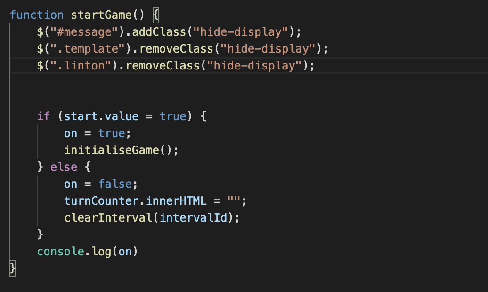

- Decided the lights for the game looked really flat compared to everything else. Tried styling them as buttons first:

   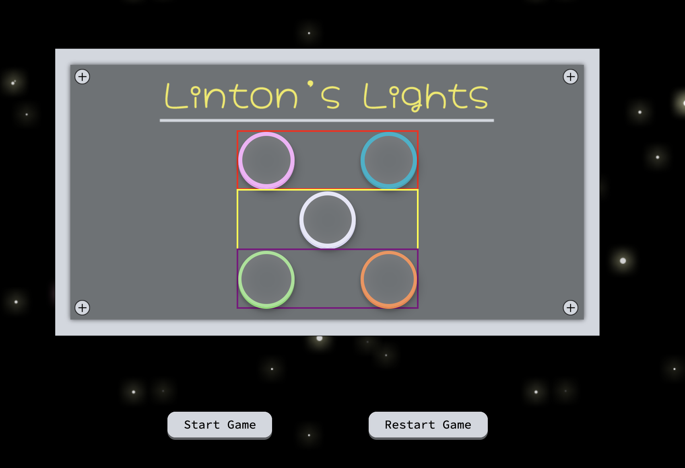

   - Although the concept could have worked, the game is called Linton's Lights so needed someting that resembled something closer to a 
   light. This was the final styling I went for:

   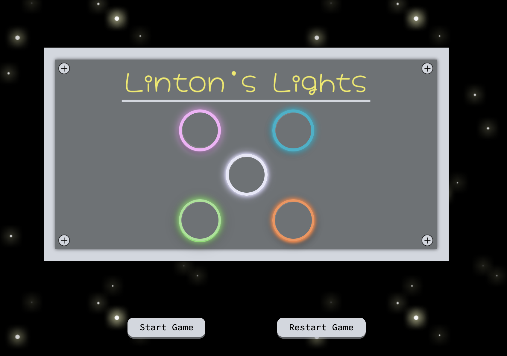

## HTML and CSS checks

- HTML: My first HTML check returned only one error. Project completion 90%: 

   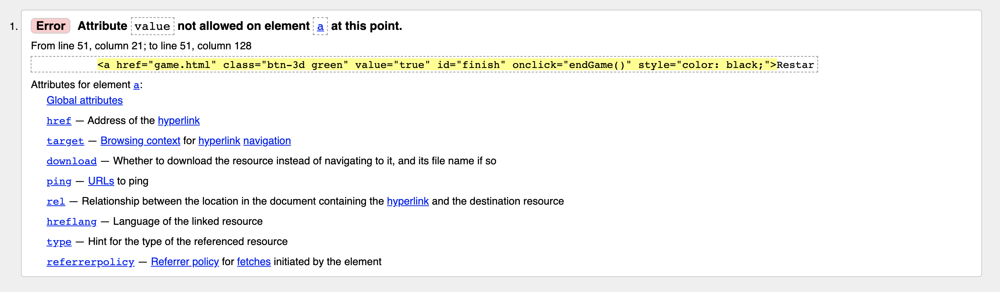

- CSS: My first CSS check returned only two errors but unsure where they originate from. They both reference element names that don't
feature anywhere in my code. Unsure of how to rectify?

   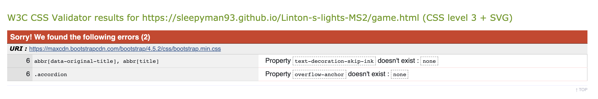

## User Testing 

- Grace my 12 year old cousin tried out the web application for me on her home desktop andn loved playing the game. She said 
sounds when pressing the lights would have made it more fun but she really enjoyed the story and charavter Linton.
   - Design was easy to use, she typed in loads of different usernames that all worked and loved how the message displayed with her username

# Bugs / De-Bugging 

1. My first known bug was encountered when trying to excecute the game function "flash" for the first time. "Flash" was not defined in "gameFlash":

   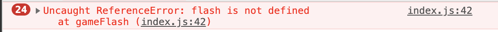

2. A similar bug occured but this time with the "compTurn" variable. My first thoughts is that I need to either define a gloabl varaible value or define the 
variable inside the function each time:

   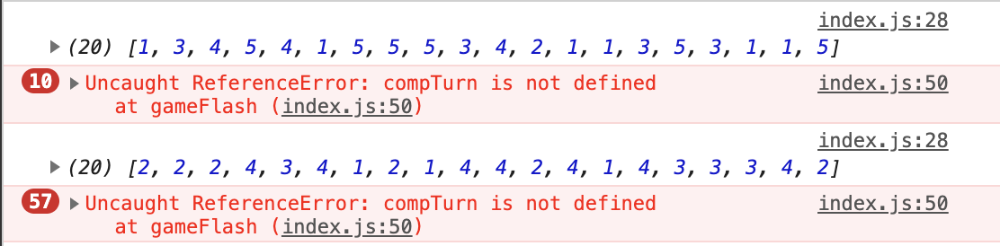

3. This issue is not necessarily a bug but quite a difficult hurdle to overcome, changing circle to fill when it's array number is selected for that turn. 

   - ### Solved: Below is the code I went with to fill the circles when their associated fucntion is called in the gameFlash Function:

   

4. Minor issue but for some reason I couldn't load an image as my background style in **animation.css**. Tried multiple forms of syntax:

   - ### Issue Fixed: 
   
   Instead of writing its direct path, I needed to preceed the root with "../" as the css file is in the same directory as the image folder.
   Fixed syntax: "../images/background.png"

5. For the homepage I wanted an animated space looking background. I chose to use keyframe animation and some simple CSS styling to accomplish this.
Thanks to <a href="https://css-tricks.com/parallax-background-css3/" target="_blank">Chris Coyier</a>, I was able to grasp a basic understanding of
the animation I wanted to achieve and grab the desired transparent star images needed. Unfortunately, I could get the stars to animate
accross the page (from right to left) but couldn't get them to reappear from the opposite side to create a nice flowing loop. Here is some inital CSS code:

   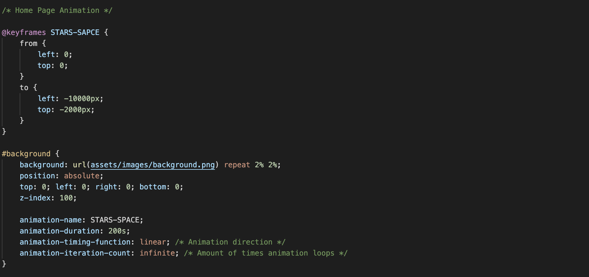
   
   - ### Issue Fixed: 
   
   Through further research I decided to address one level of the animation (#background) first. The issue I realised was not setting a 
   percentile finishing state. Using 0% and 100% states, I could tell the animation to move a drastic amount of pixels which to reach would cause it to 
   loop back first before ever finishing. I found an interesting relationship between the animation in seconds and the 100% pixel ending state. To increase
   the animation speed ten fold, you just make the seconds a tenth of whatever pixel state you delegate. Here is the fixed CSS animation:

   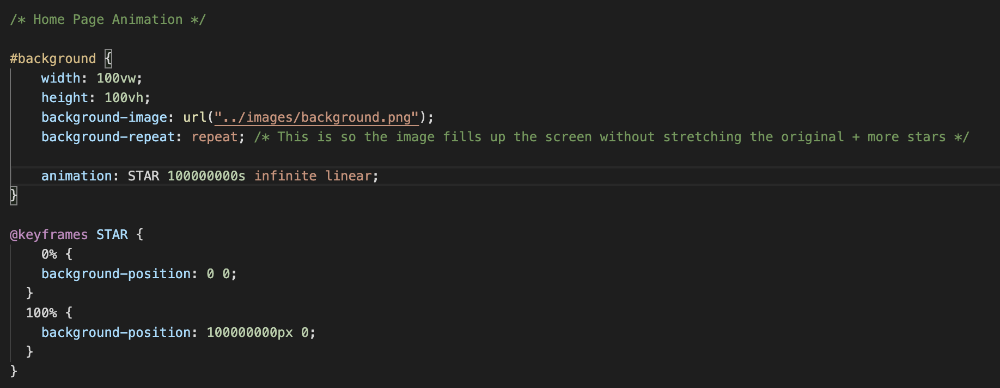

6. I encountered a bug when testing the game and its responsiveness. In the code I attempted to make it that if a variable **flash** was equal to the variable
**turn**, it would essentially stop the computer and start the turn of the user. My buttons would flash correctly, corrosponding with the order array number 
but the flash kept iterating without stopping. I console.logged the flash varaible to see if it was working: 

   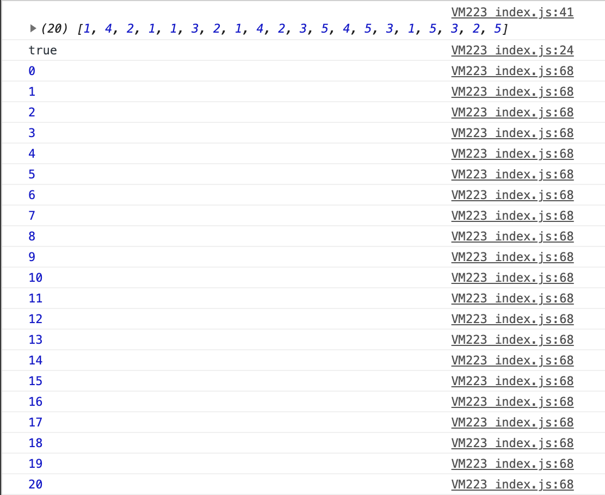
   
    The **flash** count is clearly working as you can see from the logged numbers 1-20. This indicated my issue must be with the 
    **if** statement indicating the players turn. In fact, upon further testing and logging variables to the console, I 
    deduced that the array order that determines the color was not synced with the game turn, they both acted independently. To 
    resolve this bug I will need to link the two values.

   - ### Issue Fixed:

   After multiple tweaks, testing and sending variables to the console log, I finally worked out the issue with this bug. It turns out the 
   **flash** and **turn** variables were in fact linked through the **if** method...

   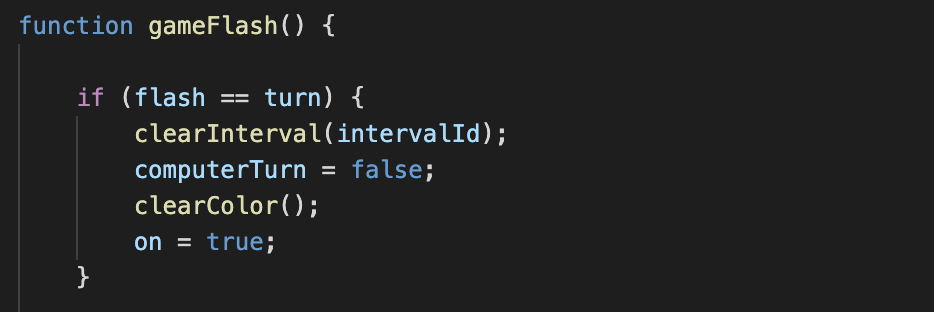

   In the end the issue was with the **turn** variable. I tried logging the **flash** variable first as mentioned above and then tried logging 
   the **turn** variable which was again iterating but returning ...

   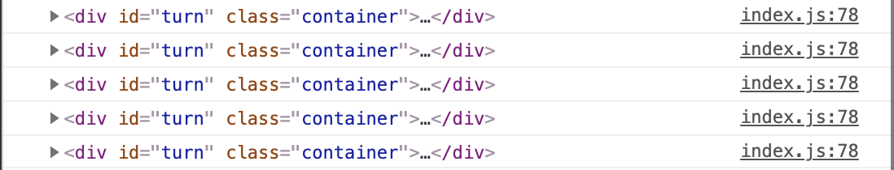

   This log was veru useful. After some research I worked out the issue was due to JavaScript scope. Although I defined the **turn** variable, it was 
   only defined LOCALLY. I defined the variable outside the initialise function to make it GLOBAL and it resolved the issue. My gameFlash function now
   works and only flashes the value of what turn the game is on. 

7. After writing the checkMove Function, the console delivered quite an interesting bug. Before the game was working fine, now an error regarding the startGame
onclick function is present: 

   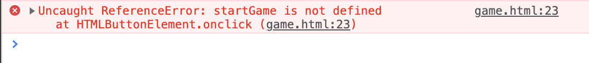

   - ### Issue Fixed: 

   This was more of the simpler solutions. After reverting back a couple saves, I realised the issue was due to another error regarding my level variable.
   I think the shorthand syntax was causing initial errors so upon removal, the game now works again. Will assess how to sort out the level variable later.

   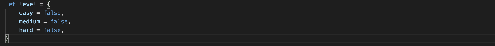

8. When styling the game page, after arranging and adding some CSS, I found that only the lime and orange lights could be clicked. I believe it might have something 
to do with how I nested the divs but this became quite an annoying bug to work around. I removed each button-box div and tried one at a time. Once the button-box with 
white, orange and lime light removed, I could click the the pink and blue buttons as options.

   

   - ### Issue Fixed:

   After testing and trials, I realised that the z-index was placing the last div in above the rest and therefore, I couldn't click the lights from button-box1/button-box2
   because they were ordered underneath button-box3.

9. Came across a small issue with the homepage. The user can click submit even with no name entered. Will need to create a method that 
needs the user input to be 3 letters or more.

   - ### Issue Fixed: 

# Technologies Used 

1. [jQuery](https://jquery.com/)
2. [Bootstrap](https://getbootstrap.com/)
3. [CSS 4](https://www.w3schools.com/w3css/)
5. [HTML 5](https://en.wikipedia.org/wiki/HTML5)
6. [JavaScript](https://www.javascript.com/)

# Project Deployment 

- Locally: To deploy a local version through Gitpod, one must create a new terminal (^ SHIFT `). Inside the terminal, next to the "$" symbol, type: 
**python3 -m http.server** and click enter. A port assigned 8000 should become open and the webpage can be viewed in the browser upon selecting "open in browser"

- Externally: To create a public version with a shareable domain. You have to sign into Github and choose the repository. Anytime you make a chnage thats committed 
you need to go back and save here for it to react online. once in the repository, move to settings. Under the settings tab scroll down to Github Pages and choose
branch: Master, Root directory and hit save. This works as I've pushed every commit to the master branch.

   

# References 

1. For help with my basic game foundation using Java: [Simon Says Java](https://www.youtube.com/watch?v=n_ec3eowFLQ)
2. For help with some keyframe animation: [CSS Tricks](https://css-tricks.com/almanac/properties/a/animation/), [TypeWriter Animation](https://codepen.io/rusjames/pen/uAFhE), [Star Animation](https://css-tricks.com/parallax-background-css3/)
3. For general help and information on topics: [StackOverflow](https://stackoverflow.com/)

# Acknowledgements 

1. My tutor Niashant Kumar. He was really informative, friendly and helped inspire me to create this project. I feel like it was a rather ambitious first attempt at Interactive
Frontend but Nishant really believed in my ideas and content which got me over the line. 

